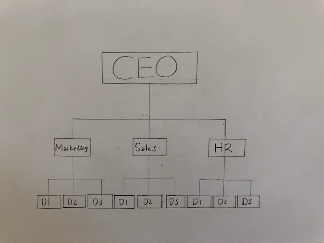
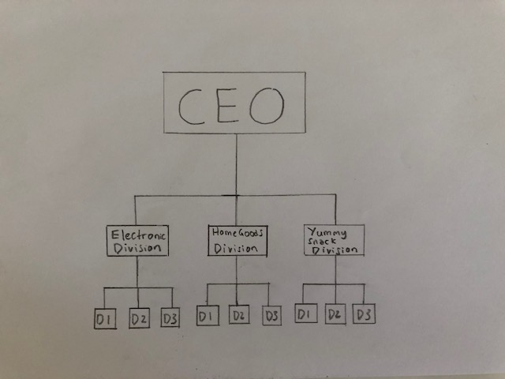
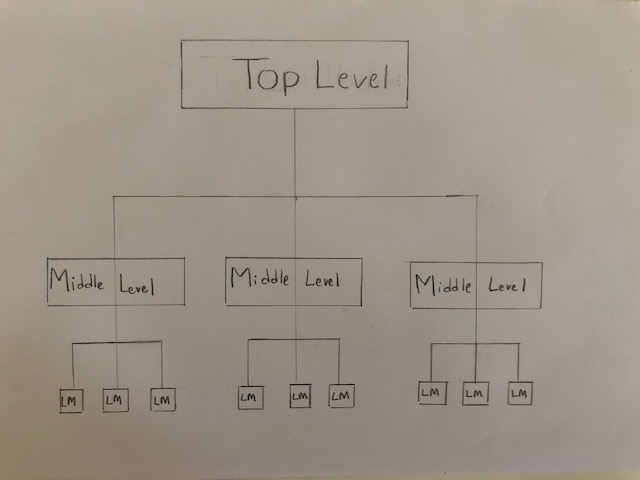

## Hierarchy a natural order?

Presentation from

- #### _Donal Bintang Satria_

- #### _Jan-Philip Muennich_

---

#### Our Quote

> "Innovation has never come through bureaucracy and hierarchy. It's always come from individuals."

_John Sculley_

---

#### Description of hierarchy

- Its a system that organizes or ranks things
  - _e.g. at school the principal is at the top_
- Also known as a pecking order or power structure
  - _to understand who's on top or whats most important_

---

### Origins of the word hierarchy

Hierarchy comes from the ancient Greek "herarchia"

composed

- "hieros" meaning sacred
- "arche" meaning leadership

At the end of the 6th century, hierarchia was for the office of high priest.

---

#### Hierarchy forms

- Stepwise order based on superordination and subordination,

  based on domination and submission

- Positioned in vertical order according to importance

---

#### What's wrong with hierarchy

- Most information that answer key questions is produced at the top
- Then must distributed downwards throughout the different levels

---

#### What's wrong with hierarchy

It is quite obvious that this is not the shortest or most efficient way!

Need for:

more direct communication and interaction between the sender and the receiver

---

#### Hierarchy and communications flow

- The importance of hierarchy in verbal and written interactions

- Natural order and established rule of engagement

- The need of adjust communication style

---

#### Implication of hierarchy: Organizational hierarchy

- Blue print of an organization's employee and jobs title

- Structure of organizational hierarchy

- Types of organizational hierarchy

---

#### Implication of hierarchy: Organizational hierarchy

- Product organizational hierarchy structure

- Advantage/disadvantage of product organizational hierarchy structure

- Functional organizational hierarchy structure

- Advantage/disadvantage of functional organizational hierarchy structure

---

#### Product organizational hierarchy structure

---

#### Functional organizational hierarchy structure

---

#### Level of managements in organizational hierarchy

- Three management level of organizational hierarchy

- Top-level

- Middle-level

- Low-level

---

#### Level of managements in organizational hierarchy

---

### Conclusion

- Hierarchy-natural order ?

- Importance of hierarchy

- Function on hierarchy in organizational context
